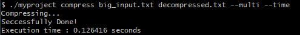

# TASK-2
## MULTITHREADED-FILE-COMPRESSION-TOOL

### Overview

- This is the task to build a program that compresses and decompresses the file.
- The program uses Run-Length Encoding for compression. The Run-Length Encoding counts the character and stores the count with the character along with it.
- The tool gracefully handles the Error Handling. It handles : 
    - Invalid arguments.
    - File not found.
    - Unsupported file formats.
    - Overflow issues(i.e too many characters repeated).
- The program is time efficient by using multi-threading and also it provides you to compare the compression with single thread compression.

### Features

- **Multithreaded Execution**: Takes advantage of multiple CPU cores to perform compression and decompression in parallel.
- **Run-Length Encoding (RLE)**: A simple yet effective lossless compression algorithm.
- **Scalable Design**: Can handle large input files efficiently.
- **Custom Mode Selection**: Choose between single-threaded or multithreaded mode for benchmarking or testing.
- **Timing Utility**: Measure execution time of operations.
- **Cross-Platform**: Compatible with major operating systems with g++ support.

---

### Technologies Used

- **C++20**
- **Standard Template Library (STL)**
- **Threads (`<thread>`)**
- **File I/O (`<fstream> | <ifstream> | <ofstream>`)**
- **Command-line Argument Parsing**

---

### CODE

- The program uses to **CLI(Command-Line Interface)** to take input from users.
- In main() function,
    - Firstly, we dp arguments handling given by user.
    - Then, we use compress/decompress the file and then we update the output file.
    - Then, we compute the time of execution and display the time.
    - Also, than we handle the multi-threading compression the input file.
- **THE FUNCTION** :
    - ***read()***:- reads the input file and store it in a string stram using the .rdbuf() function.
    - ***write()***:- writes the content in the stream into the output file.
    - ***compress()***:-compresses the string using a single thread.
    - ***mcompress()***:-compresses the string using the multi-threads, in this function the content is divided into chunks and then assigned to each thread, thus the compression works parallely.
    - ***decompress()***:- decompresses the file.

### SINGLE VS MULTI-THREADED COMPRESSION
 
- The tool provide various **verbose** :
    - `--help` : shows how the tool works and the format on how to write command.
        
    - `--single` : uses single thread to compress and decompress.
    - `--multi` : uses multi-threading to compress file.
    - `--time` : displays the time of execution.

- Compressing a big file using a single thread :

    

- Compressing a big file using multi-threading : 

    

    As you can see the multi-threaded compression takes lesser time compared to single threaded compression—As the file size increases the difference of time increases.

- The smaller files may have the time to compress using single thread lesser than the multi threaded compression, because the threads are little time costly and occupies some space too thus, it takes more time for small size file compression.

- Compressing a small file using a single thread : 

    

- Compressing a small file usiing multi thread : 

    

- Conclusion : Thus the final verdict is, for the big size file the multi-threaded compression is the best but for the small file its better to use single thread.

- Decompression :

    

-This was the input-output for the small file decompression
    

    